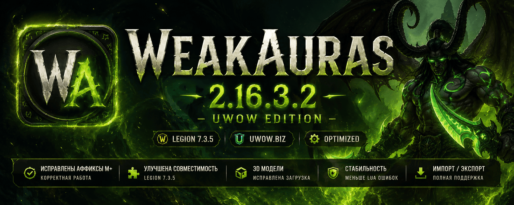

<p align="center">
  
</p>

<h1 align="center">
WeakAuras 2.16.3.2 — UWOW Edition
</h1>


## Информация

Специальная версия WeakAuras для сервера UWOW.BIZ.

Проект направлен на исправление несовместимостей оригинальной версии WeakAuras для клиента World of Warcraft Legion 7.3.5 и улучшение работы пользовательских сборок.

---

## Основные возможности

* Импорт и экспорт WeakAuras
* Поддержка пользовательских триггеров
* Поддержка таймеров и индикаторов
* Отображение 3D-моделей
* Условия загрузки по персонажу, специализации и контенту
* Поддержка Mythic+ и рейдового контента

---

## Что изменено в версии 2.16.3.2 — UWOW Edition

### Исправления Mythic+

* Исправлена работа Mythic+ аффиксов Legion.
* Скорректированы ID аффиксов.
* Исправлены условия загрузки WeakAuras по аффиксам.
* Исправлено определение активных недельных аффиксов.
* Исправлена работа вкладки «Загрузка» для аффиксов.

### Исправления WeakAuras

* Исправлена работа шаблонов импорта.
* Исправлено отображение пользовательских WeakAuras.
* Исправлены ошибки совместимости с Legion 7.3.5.
* Уменьшено количество Lua ошибок.
* Улучшена стабильность работы аддона.

### Исправления моделей

* Исправлена загрузка 3D-моделей.
* Исправлена работа DisplayID.
* Улучшено отображение NPC и игровых объектов.

---

## Установка

Распакуйте папку:

```text
WeakAuras
```

в каталог:

```text
World of Warcraft\Interface\AddOns\
```

После установки выполните:

```text
/reload
```

или перезапустите игровой клиент.

---

## Где найти готовые WeakAuras

Для поиска готовых настроек под ваш класс и специализацию используйте:

### Legion WeakAuras

https://wago.io/legion-weakauras/

### Поиск WeakAuras для Legion

https://wago.io/search/imports/wow/weakaura?q=legion

---

## Импорт WeakAuras

1. Откройте настройки:

```text
/wa
```

2. Нажмите кнопку:

```text
Импорт
```

3. Скопируйте строку импорта с сайта Wago.
4. Вставьте её в окно импорта.
5. Нажмите:

```text
Импортировать
```

---

## Полезные ссылки

### Сервер UWOW

https://uwow.biz/

### Discord проекта

https://discord.gg/g6n6RSfwFg

---

## Автор

**Партной | Спиртной**

Адаптация, тестирование и поддержка версии UWOW Edition.

---

## Благодарности

Отдельная благодарность игрокам сервера UWOW.BIZ за тестирование, обратную связь и помощь в развитии проекта.

---

## Совместимость

* World of Warcraft Legion 7.3.5
* UWOW.BIZ

---

© UWOW Addons Project
